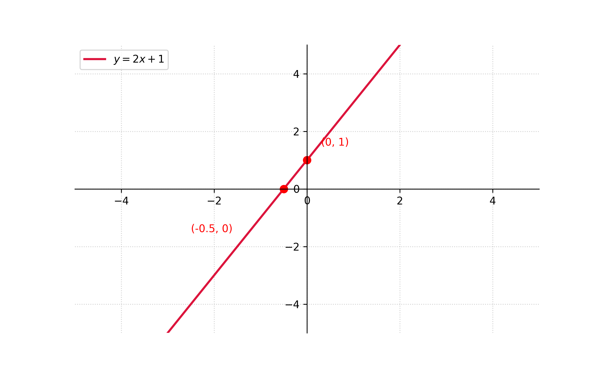

# Funcion Lineal

## Ejercicios
1. $y = 2x + 1$
2. $y = -x + 3$
3. $y = 3x - 2$
4. $y = -2x - 1$
5. $y = x + 2$
6. $y = -x - 3$
7. $f(x) = 2x - 3$
8. $f(x) = -2x + 3$
9. $f(x) = x - 2$
10. $f(x) = -x + 2$

## Respuestas a Ejercicios

1. $y = 2x + 1$
$$
\begin{aligned}
\text{si } x &= 0 :\\
y_{(0)} &= 2(0) + 1 & \\
y_{(0)} &= 1 & \\
y &= 1 \implies \text{el par ordenado es } (0,1) \\
\\
\text{si } y &= 0 : \\
0 &= 2x + 1 & \\
-2x &= 1 & \\
x &= -\frac{1}{2}  \implies \text{el par ordenado es } \left(-\frac{1}{2}, 0\right)
\end{aligned}
$$

